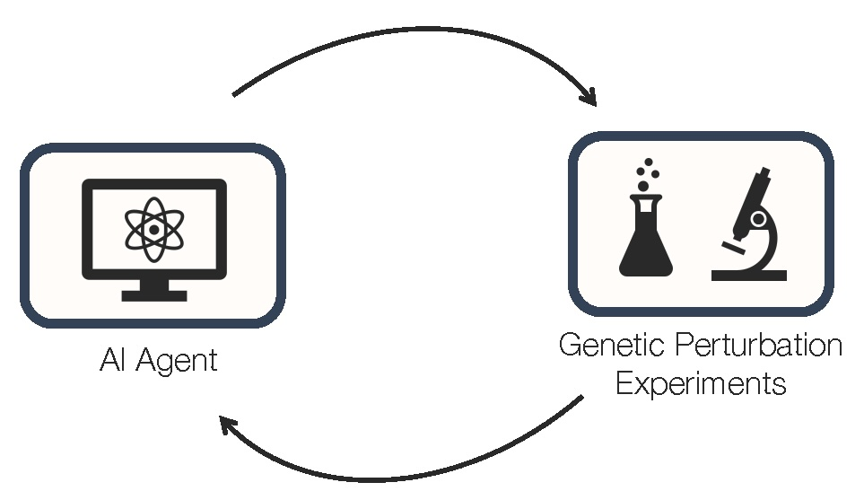

# BioDiscoveryAgent

BioDiscoveryAgent is an AI agent for closed loop design of 
biological experiments. BioDiscoveryAgent designs genetic perturbation experiments 
using only an LLM (Claude v1) paired with a suite of tools (literature 
search, gene search, AI critique).



## Installation

Install required packages using the following command:
```
pip install -r requirements.txt
```
Claude API key is required for running the code. Please visit the [Anthropic website](https://docs.anthropic.com/en/docs/getting-access-to-claude) 
for more information

## Datasets

1. IFNG
2. IL2
3. Carnevale22_Adenosine
4. Scharenberg22
5. Sanchez21_down
   
## Commands

Python 3 is required to run the scripts (3.10 recommended). To run the baseform BioDiscoveryAgent with Claude-3.5-Sonnet on the IFNG dataset:

```
python research_assistant.py  --task perturb-genes-brief --model claude-3-5-sonnet-20240620 --run_name test --data_name IFNG --steps 5 --num_genes 128 --log_dir sonnet
```
You can also similarly run with OpenAI models:
```
python research_assistant.py  --task perturb-genes-brief --model gpt-4o --run_name test --data_name IFNG --steps 5 --num_genes 128 --log_dir gpt4
```
To run the agent with all tools (using Reactome pathway search as in the paper):
```
python research_assistant.py  --task perturb-genes-brief --model claude-3-5-sonnet-20240620 --run_name test --data_name IFNG --steps 5 --num_genes 128 --log_dir sonnet_all --lit_review True --critique True --reactome True
```
To run the agent with similar/dissimilar gene search tool, you have to specify the directory where the csv file for the gene features is saved. If there is no achilles.csv downloaded in the specified directory, the program will automatically download the file from Figshare. Make sure there is at least 300MB of free space in the specified directory.
```
python research_assistant.py  --task perturb-genes-brief --model claude-3-5-sonnet-20240620 --run_name test --data_name IFNG --steps 5 --num_genes 128 --log_dir sonnet_sim --gene_search True --csv_path /directory/containing/csv/
```
To calculate hit rate on the predictions:
```
python analyze.py  --model {model}_{tools} --dataset IFNG --rounds 5
```


## Preprocessing your own dataset

To preprocess your own dataset, please follow the instructions in the [preprocessing notebook](notebooks/Preprocessing.ipynb)

## Preprint

Please cite our [preprint](http://arxiv.org/abs/2405.17631) if you use this code in your research:

```
@article{roohani2024,
  title={BioDiscoveryAgent: An AI Agent for Designing Genetic Perturbation Experiments},
  author={Roohani, Yusuf and Lee, Andrew and Huang, Qian and Vora, Jian and Steinhart, 
  Zachary and Huang, Kexin and Marson, Alexander, and Liang, Percy and Leskovec, Jure},
  journal={arXiv preprint},
  year={2024},
}
```